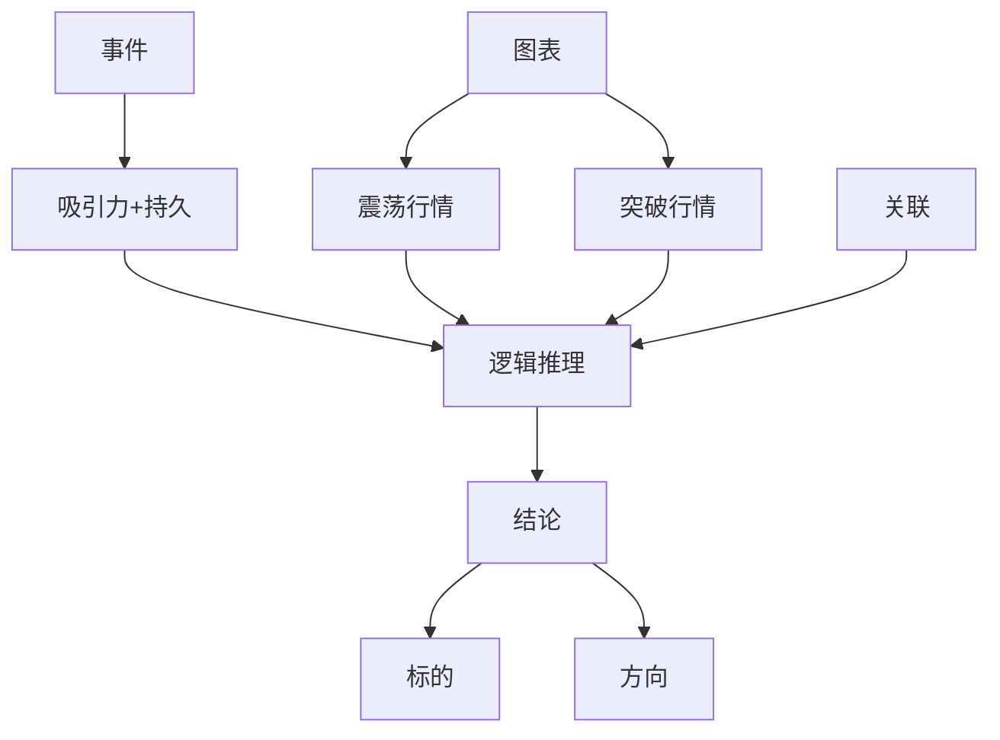

```mermaid
graph TD
    Event[事件] --> EventHeavy[吸引力+持久]
    EventHeavy --> Logic[逻辑推理]


    Diagram[图表] --> zhendang[震荡行情] --> Logic
    Diagram[图表] --> breaking[突破行情] --> Logic

    Relation[关联] --> Logic

    Logic --> answer[结论]

    answer --> bd[标的]
    answer --> dir[方向]

    
```