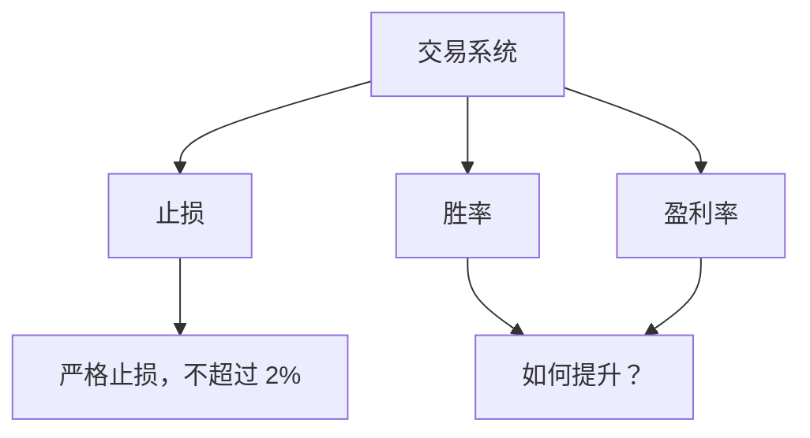

```mermaid
graph TD
    TradingSystem[交易系统] --> zs[止损]
    TradingSystem[交易系统] --> sl[胜率]
    TradingSystem[交易系统] --> yll[盈利率]
    zs --> ygzs[严格止损，不超过 2%]
    sl --> how[如何提升？]
    yll -->how[如何提升？]
```

