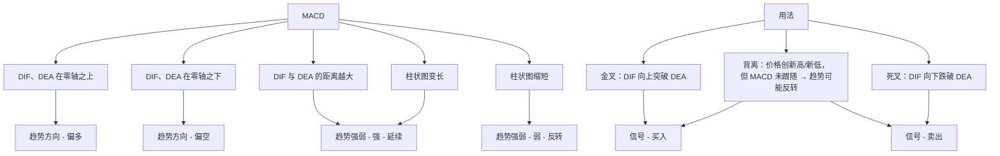
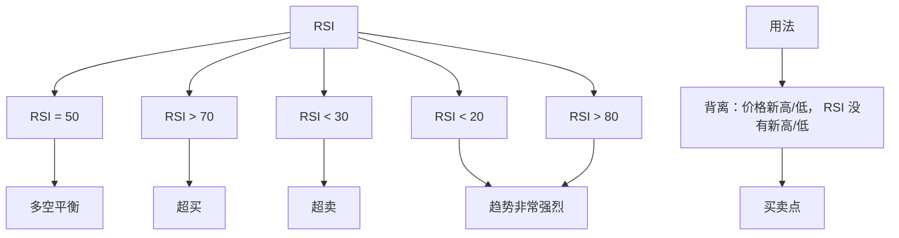

# RSI

BOLL

K 线在中轨上方 → 市场偏多。
K 线在中轨下方 → 市场偏空。

带宽变宽 → 波动加剧，趋势可能延续
带宽变窄 → 波动收敛，可能孕育突破

上轨 → 阻力位，价格接近时可能回落
下轨 → 支撑位，价格接近时可能反弹

轨道突破
	- 价格突破上轨 → 市场强势，可能继续上涨。
	- 价格跌破下轨 → 市场弱势，可能继续下跌。

收口与开口
	- 收口：上轨和下轨逐渐收窄，说明波动减弱，行情即将选择方向。
	- 开口：带宽突然放大，说明行情开始加速。

中轨回调/反弹
	- 上涨趋势中：价格回调到中轨获得支撑 → 继续上涨。
	- 下跌趋势中：价格反弹到中轨受阻 → 继续下跌。
震荡区间交易	
	- 接近下轨买入，上轨卖出，中轨作为平衡参考。

局限
	- 在震荡市中更有效，但趋势行情中需要结合其他指标（如 MACD、RSI）。

典型解读
	1.	布林开口放大 → 波动增强，行情可能延续。
	2.	布林收口 → 波动减弱，往往是大行情前兆。
	3.	价格突破轨道 → 需确认真假突破。
	4.	价格在轨道间上下波动 → 适合区间操作。
